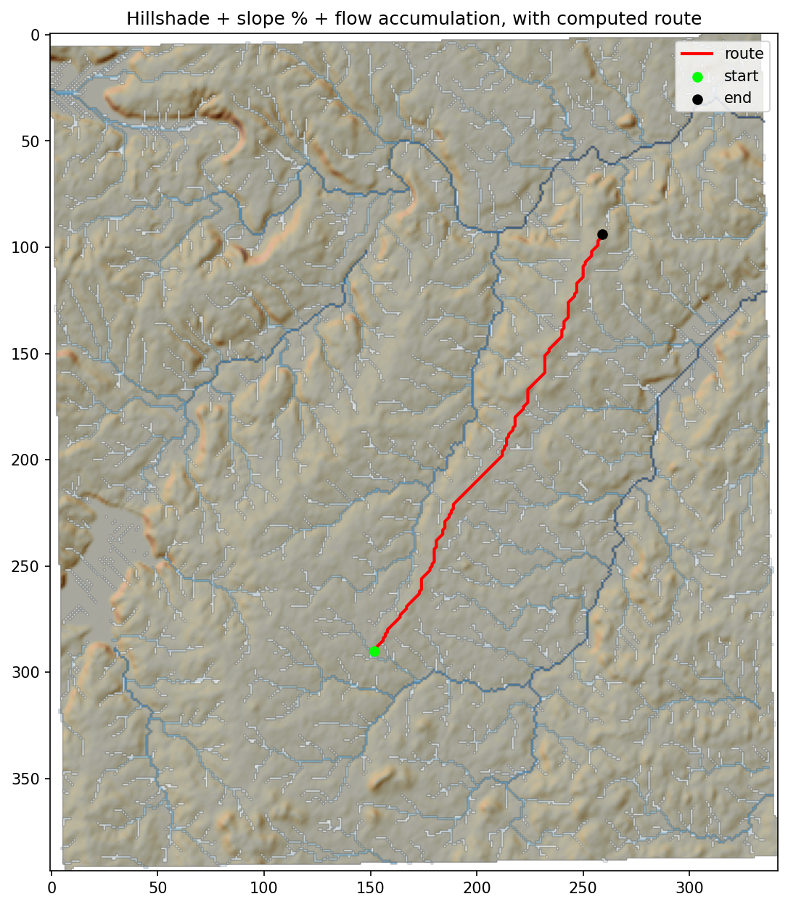
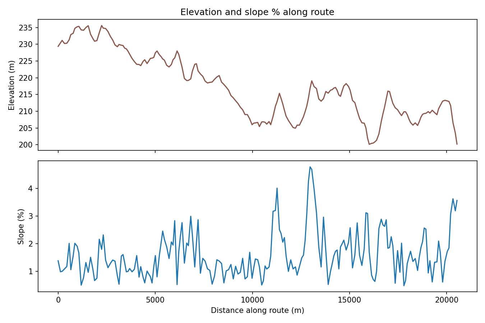

# FloGravity

Hydraulically-constrained least-cost path for a gravity-fed drainage channel
or pipe, over an arbitrary DEM.

## Why this exists

This is a scoped warm-up project for a larger capstone: **terrain-aware
drainage route optimization**. The capstone needs a full network solver
(multiple inlets draining to shared outlets), but before building that, this
project builds and validates the actual technical pipeline it depends on —
DEM ingestion, terrain derivatives, hydrological derivatives, and constrained
least-cost routing — scoped down to a single point-to-point route.

### Why this isn't a generic hiking-trail least-cost path

A hiking-trail LCP just wants to avoid steep terrain. A gravity-fed drainage
line has different, stricter constraints:

- **It needs a minimum continuous downhill grade.** Gravity flow stalls on
  near-flat ground — a route that's technically "low cost" because it's flat
  is not actually usable.
- **It has a maximum grade too.** Too steep and you get erosion and
  velocities the channel/pipe can't handle. Beyond a hard ceiling, a slope is
  simply not buildable.
- **Crossing a natural drainage channel is not free.** A route that runs
  parallel to an existing flow-accumulation channel is cheap; one that cuts
  across it perpendicularly should be penalized, and more so for a major
  channel than a trickle.

The cost function below (Phase 4) and the directional edge cost (Phase 5)
exist specifically to encode those three constraints — not "avoid slope in
general."

## Pipeline

| Module | Phase | What it does |
|---|---|---|
| `dem_io.py` | 1 | Load a GeoTIFF, reproject geographic DEMs to local UTM, build a nodata mask |
| `terrain.py` | 2 | Slope (deg + %) and aspect (0-360°) via `np.gradient` |
| `hydrology.py` | 3 | pysheds DEM conditioning (fill pits → fill depressions → resolve flats), D8 flow direction, flow accumulation |
| `cost_surface.py` | 4 | Isotropic (per-cell) cost surface + MVP routing (`skimage.graph.route_through_array`) |
| `routing.py` | 5 | Anisotropic routing: a custom Dijkstra over an 8-connected graph that penalizes crossing a channel perpendicular to its flow direction |
| `cli.py` | 6 | Wires it all together: any DEM in, lon/lat start/end, full set of run artifacts out |

Isotropic (Phase 4) treats a cell's cost the same regardless of which
direction you enter it. Anisotropic (Phase 5) is what actually distinguishes
this from a standard LCP tutorial: it can express "cheap to run alongside a
channel, costly to cross it head-on," which the isotropic version cannot.

## Install

```bash
pip install -r requirements.txt
# add --break-system-packages if pip refuses on an externally-managed environment
```

## Sample data

```bash
git clone --depth 1 https://github.com/mdbartos/pysheds.git /tmp/pysheds_src
cp /tmp/pysheds_src/data/dem.tif sample_data/dem.tif
```

This is a real DEM over Texas (EPSG:4326, ~360×370 cells, elevations
147-298m), bounds roughly `left=-97.485, bottom=32.522, right=-97.179,
top=32.822`.

## Usage

```bash
python -m drainage_lcp.cli \
  --dem sample_data/dem.tif \
  --start "-97.35,32.60" \
  --end "-97.25,32.75" \
  --coord-format lonlat \
  --min-slope-pct 0.5 --max-slope-pct 15 --hard-max-slope-pct 45 \
  --w-slope 0.5 --w-channel 0.3 --w-direction 0.2 \
  --mode anisotropic \
  --output-dir outputs/run1
```

Works against any GeoTIFF DEM — there's no hardcoded CRS, bounds, or shape
anywhere in the pipeline. `--start`/`--end` are always lon/lat (WGS84); they
get converted through the DEM's native CRS to pixel indices, and the CLI
raises a clear error (not a stack trace) if a point falls outside the DEM's
extent.

### Parameters

These are engineering judgment calls, not settled physics — tune them per
project:

| Flag | Default | Meaning |
|---|---|---|
| `--min-slope-pct` | 0.5 | Below this, grade is too flat for reliable gravity flow → penalized |
| `--max-slope-pct` | 15 | Above this (but below hard max), penalized on a linear scale |
| `--hard-max-slope-pct` | 45 | Above this, the cell is treated as impassable |
| `--w-slope` | 0.5 | Weight on the slope penalty |
| `--w-channel` | 0.3 | Weight on the (per-cell) channel-proximity penalty |
| `--w-direction` | 0.2 | Weight on the anisotropic perpendicular-crossing penalty (Phase 5 / `--mode anisotropic` only) |
| `--mode` | anisotropic | `isotropic` runs the Phase 4 MVP path, useful for comparison/debugging |

### Outputs (written to `--output-dir`)

- `path.geojson` — the route as a LineString, reprojected back to the DEM's
  original source CRS.
- `cost_surface.png` — hillshade + slope% + flow-accumulation overlay, with
  the route drawn on top.
- `profile.png` — elevation and slope% along the route (x-axis = distance).
- `report.md` — path length, total accumulated cost, min/mean/max slope%,
  count of significant channel crossings, total elevation drop, and the
  parameters used.
- `run_config.json` — every parameter used, for reproducibility.

### Example output

Route from the CLI example above, over the sample Texas DEM:





## Tests

```bash
python -m pytest tests/test_pipeline.py -v
```

Covers DEM/nodata handling, slope on a synthetic tilted plane (checked
against the exact analytic constant), a trivial routing sanity check, CLI
rejection of out-of-bounds coordinates, and a full integration run against
the sample DEM.

## Stretch goals (not implemented here)

Multi-objective (Pareto) routing, multi-inlet network routing, and
validation against a real constructed drainage line — these are what would
turn this from a portfolio piece into the actual capstone.
